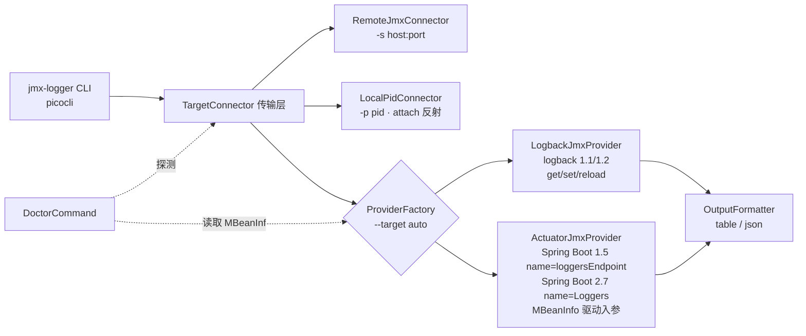

## 产品概述

`jmx-logger` 是一个独立 CLI 工具，通过 JMX 远程查看/修改 Logback 的 Logger 级别并重载配置。用户实际运行栈为 **JDK 1.8 + Spring Boot 1.5.6**，计划升级到 **Spring Boot 2.7.18**。需要一份分阶段、每阶段可独立验收与回滚的改进计划，而不是一次性重写。

## 已核实的关键前提（决定方案走向）

- **升级到 Spring Boot 2.7.18 不会破坏现有工具**：Spring Boot 2.7.18 受管 `logback-classic = 1.2.12`，而 logback `v_1.1.11` 与 `v_1.2.13` 的 `ch/qos/logback/classic/jmx/` 目录文件完全一致（`JMXConfigurator.java` 均为 9660 字节），即 1.1.x → 1.2.x 的 JMX 操作面不变。现有 `JmxClient` 调用的方法名/ObjectName 在两个版本上都有效。
- **Spring Boot 2.7.18 要求 Java 8**（兼容至 Java 21），因此 `maven.compiler.source/target=8` 必须保持不动。
- **Spring Boot 2.7 的 Actuator JMX 默认全暴露**：`management.endpoints.jmx.exposure.include` 默认为 `*`，`loggers` 端点 JMX 列默认为 Yes ⇒ 只要目标应用带 actuator，即可零配置作为兜底通道（与 Spring Boot 3.x 默认仅 `health` 不同，不可混写）。

  > **更正（实测，见 `tools/e2e/`）**：这条结论不完整。Spring Boot **2.2 起 `spring.jmx.enabled` 默认为 `false`**，
  > 只引 `spring-boot-starter-actuator` 端点**不会注册到 JMX**——`exposure.include` 默认确实是 `*`，
  > 但前提是存在 MBeanServer。2.7.18 上实测到的签名：`configureLogLevel(java.lang.String, java.lang.String)`、
  > `loggers()` / `loggerLevels(String)` 均返回 `java.util.Map`（不是 `LogLevel` 枚举，也不是 `CompositeData`/`TabularData`）。
- **logback ≥ 1.3 才彻底移除 JMXConfigurator**（`v_1.4.14`/`v_1.5.13`/master 已无 jmx 目录）。这只影响未来 JDK 17 + Spring Boot 3 的场景，本计划通过 Provider 抽象预留，不作为当前重点。

### 真实目标进程实测结论（2026-09-19，本机 `127.0.0.1:19000` 上的 Spring Boot 1.5 应用）

以下结论来自对真实目标 JVM 的 MBeanInfo 抓取 + logback `JMXConfigurator.java`（v_1.1.11 / v_1.2.12）源码逐行核对，是本计划的硬事实，**P1 重构与 P3/P4 编码必须以此为准，不得再靠猜**：

- **Logback 配置器 MBean 实际形态**（与现有代码假设一致，可放心保留）：
  `ch.qos.logback.classic:Name=default,Type=ch.qos.logback.classic.jmx.JMXConfigurator`
  属性：`LoggerList`（`java.util.List`，只读，经 RMI 反序列化为 `ArrayList<String>`，实测 783 项）、`Statuses`（只读）；
  操作：`String getLoggerLevel(String)`、`String getLoggerEffectiveLevel(String)`、`void setLoggerLevel(String,String)`、`void reloadDefaultConfiguration()`、`void reloadByFileName(String)`、`void reloadByURL(java.net.URL)`。
- **级别读取返回空串而非 `null`**：`getLoggerLevel` / `getLoggerEffectiveLevel` 在「logger 不存在」和「logger 未单独配置级别」两种情况下都返回 `""`（源码常量 `JMXConfigurator.EMPTY`）。因此判定"继承"必须判空串，**不能判 `null`**（现有 `GetCommand` 只判 `null`，导致真实输出是空白而非文档所写的 `(inherited)`，已在 P0 修掉）。
- **`setLoggerLevel` 的 null 语义与直觉相反**：源码开头即 `if (levelStr == null) return;`，传 **Java `null` 被静默忽略**；恢复"继承父 logger"必须传**字符串 `"null"`**（`"null".equalsIgnoreCase(levelStr)` → `logger.setLevel(null)`）；传入无法识别的级别字符串同样静默忽略（`Level.toLevel(x, null) == null`）。⇒ P4 的 `clear` 命令必须下发字符串 `"null"`（空串与 Java null 都会被目标侧静默忽略），
且 `set` 侧仍要先做级别白名单校验（空串、`"null"` 一律拒绝并指引 `clear`），
否则用户会看到"命令成功但级别没变"。
- **目标进程带 Spring Boot 1.5 actuator，且 JMX 暴露的是 Spring Boot 1.5 命名模型**（不是 Spring Boot 2 的 `name=Loggers`），实测签名：
  ```
  org.springframework.boot:type=Endpoint,name=loggersEndpoint
    ATTR Loggers : java.lang.Object
    OP   java.lang.Object getLoggers()
         → LinkedHashMap{ "levels"  → ArrayList<String> [OFF,ERROR,WARN,INFO,DEBUG,TRACE]
                          "loggers" → LinkedHashMap{ 名称 → {configuredLevel, effectiveLevel} } }
    OP   java.lang.Object getLogger(String loggerName)
         → LinkedHashMap{ "configuredLevel" → String|null, "effectiveLevel" → String|null }
    OP   void setLogLevel(String loggerName, String logLevel)
  ```
  返回值是**普通 LinkedHashMap（非 CompositeData/TabularData）**，未配置的 `configuredLevel` 是 Java `null`（与 logback 侧的空串不同）。⇒ Spring Boot 1.5 兜底通道**现在就可用**，且 `getLoggers()` 一次拿全量（1 次 RMI vs logback 侧 2N 次），性能收益显著。**原计划"Spring Boot 1.5 actuator 不在支持范围"的判断据此作废。**

## 核心功能增量（按用户收益排序）

1. **连不上也能用**：新增 `-p/--pid` 本地 attach（目标 JVM 未开 JMX 端口时，通过 attach API 动态启动本地管理代理）。
2. **知道为什么连不上**：新增 `doctor` 子命令，区分"没配 `<jmxConfigurator/>` / 没开 JMX 端口 / logback 版本过高 / 可走 Actuator 兜底"，并输出目标侧该加的配置。
3. **可插拔 Provider**：`logback`（现逻辑，支持 reload）与 `actuator`（兜底，不支持 reload，**覆盖 Spring Boot 1.5 与 2.7 两种命名模型**），`auto` 自动探测（取值即 `-t/--target` 的取值）。
4. **健壮性与打磨**：统一错误退出码与 `--verbose`、支持重置为继承级别、`--object-name` 多 LoggerContext 选择、`--json` 输出、**logger 不存在时明确报错并返回非 0 退出码**、单元测试与目标侧配置文档。

## 技术栈

- 语言/构建：Java 8（`maven.compiler.source/target=8`，**不升级**），Maven + `maven-shade-plugin:3.5.1` 打 fat jar。
- 唯一运行时依赖保持 `info.picocli:picocli:4.7.6`；**不引入任何新的运行时第三方依赖**（JSON 走 JDK 自带 `HttpURLConnection` + 自写轻量解析，测试依赖仅 `junit:junit:4.13.2` test scope）。
- 目标侧：Spring Boot 1.5.6 / 2.7.18，logback 1.1.x / 1.2.x，JMX RMI。

## 实施策略

关键点是：**先把"传输层"与"日志操作 Provider"解耦**，后续能力逐层叠加，每一步都可回滚、每一步都有明确验收方式。



架构要点：

1. **Provider 优先顺序**：`auto` 下先探测 `ch.qos.logback.classic:Type=ch.qos.logback.classic.jmx.JMXConfigurator,*`（能力最全，含 reload），找不到再探测 Spring Boot 的 logger 端点。
2. **Actuator 端点必须双命名探测 + MBeanInfo 驱动，禁止写死签名**：
   - Spring Boot **1.5**：`org.springframework.boot:type=Endpoint,name=loggersEndpoint`，操作 `getLoggers()` / `getLogger(String)` / `setLogLevel(String,String)`（已实测，见上文）。
   - Spring Boot **2.7**：`org.springframework.boot:type=Endpoint,name=Loggers`，操作 `loggers()` / `loggerLevels(String)` / `configureLogLevel(String, ?)`。
   - 实现上不按版本号分支，而是**先查 ObjectName、再读 `mbsc.getMBeanInfo(name)` 的 `MBeanOperationInfo` 动态构造 `params/signature`**：入参 `String` 直接传；遇到自定义类型（如 `org.springframework.boot.logging.LogLevel`）走 `Class.forName + Enum.valueOf` 构造，失败则明确报错。
   - 返回值可能是 `LinkedHashMap`（Spring Boot 1.5 实测）、CompositeData/TabularData 或 JSON 字符串，Provider 要按实际类型分发解析，统一收敛到 `LoggerInfo{name, configuredLevel, effectiveLevel}`。
   - `doctor` 子命令负责把每个候选端点的真实 MBeanInfo 打印出来，让这层版本差异始终可观测。
3. **能力协商**：`LoggerProvider.capabilities()` 声明是否支持 `reload`；Actuator Provider 下 `reload` 给出可执行替代建议（logback.xml 开 `scan="true"`，或目标侧加自定义 endpoint），而不是含糊失败。
4. **向后兼容**：阶段一/二对外的 `get/set/reload` 参数与输出格式保持不变；`auto` 的默认选择等价于今天的行为。

## 目标应用侧最小配置清单

- 走 Logback JMXProvider：`logback.xml` 中 `<jmxConfigurator/>` + 启动参数
`-Dcom.sun.management.jmxremote -Dcom.sun.management.jmxremote.port=19000 -Dcom.sun.management.jmxremote.rmi.port=19001 -Dcom.sun.management.jmxremote.authenticate=true -Dcom.sun.management.jmxremote.ssl=false -Djava.rmi.server.hostname=<本机IP>`（`rmi.port` 必须与 `port` 一致，否则防火墙后握手失败）。
- 走本地 PID attach：**目标侧零配置**（前提是本机同用户、非 JRE 最小镜像）。
- 走 Actuator 兜底（**Spring Boot 1.5**：已实测可用；**Spring Boot 2.7**：同左）：仅需 classpath 有 `spring-boot-starter-actuator`，无需 `management.*` 配置（默认 JMX include=`*`、loggers 默认暴露）；若目标是 Spring Boot 3.x 才需要显式 `management.endpoints.jmx.exposure.include=health,loggers`。
  - Spring Boot 1.5 的 ObjectName 是 `org.springframework.boot:type=Endpoint,name=loggersEndpoint`（小写开头 + `Endpoint` 后缀），Spring Boot 2.7 是 `type=Endpoint,name=Loggers`，**两者都要探测**。

## 目录结构

```
/bak/java/jmx-logger/
├── pom.xml                                          # [MODIFY] 仅新增 junit 4.13.2 test 依赖；compiler 8 保持不变
├── Justfile                                         # [MODIFY] 补 build / run / doctor / test 目标
├── README.md                                        # [NEW] 用法、目标侧配置矩阵、升级到 2.7.18 的兼容性说明
└── src/main/java/com/jmxlogger/
    ├── JmxLoggerCli.java                            # [MODIFY] 注册 doctor；--timeout/--verbose 已落地，--target/--json 待 P4；
    │                                                #          用 IExecutionExceptionHandler + ExitCodes 统一收口（子命令不再 System.exit）
    ├── JmxClient.java                               # [MODIFY] 拆分为「连接层」+「Logback 调用」；保留方法名便于逐步迁移，
    │                                                #          内部委派给 transport/RemoteJmxConnector 与 provider/LogbackJmxProvider
    ├── command/                                     # 子命令单独成包，与 transport/（怎么连）、provider/（怎么操作）对称
    │   ├── GetCommand.java                          # [MOVED] 改用 LoggerProvider；支持 --json；新增 --no-effective 减少 RMI 往返
    │   ├── SetCommand.java                          # [MOVED] 级别白名单严格校验；空串/"null" 一律拒绝并指引 clear
    │   ├── ReloadCommand.java                       # [MOVED] 依据 capabilities 判定，Actuator provider 下输出替代方案
    │   └── DoctorCommand.java                       # [DONE] 连接 → 列出候选 MBean → 打印 MBeanInfo 操作签名 → 给出目标侧应加的配置
    ├── transport/
    │   ├── TargetConnector.java                     # [NEW] AutoCloseable，暴露 getMBeanServerConnection()
    │   ├── RemoteJmxConnector.java                  # [NEW] 现有 host:port RMI 逻辑迁移（service:jmx:rmi:///jndi/rmi://...）
    │   └── LocalPidConnector.java                   # [NEW] 反射调用 com.sun.tools.attach.VirtualMachine#startLocalManagementAgent，
    │                                                #          取 com.sun.management.jmxremote.localConnectorAddress 后连 JMX
    ├── provider/
    │   ├── LoggerProvider.java                      # [NEW] 接口：id()/list()/get()/setLevel(name, levelOrNull)/reload(file)/capabilities()
    │   ├── LoggerInfo.java                          # [NEW] name / configuredLevel / effectiveLevel
    │   ├── LogbackJmxProvider.java                  # [NEW] 迁移现有 getLoggerLevel/setLoggerLevel/reloadByFileName 等调用
    │   ├── ActuatorJmxProvider.java             # [NEW] 双命名探测（Spring Boot 1.5 loggersEndpoint / Spring Boot 2.7 Loggers），
    │   │                                            #      按 MBeanInfo 决定入参与返回值解析（Map / CompositeData / JSON 串）
    │   └── ProviderFactory.java                     # [NEW] auto/logback/actuator 选择与探测顺序
    ├── support/                                     # 退出码与格式化属支撑层，不混进 command/
    │   ├── ExitCodes.java / CommandSupport.java     # [DONE] 退出码常量 + 异常到退出码/报错文本的映射
    │   ├── JmxInvocation.java                       # [NEW] 按 MBeanOperationInfo 构造 signature/params（解决 LogLevel 枚举不确定性）
    │   └── OutputFormatter.java                     # [NEW] 表格与 JSON 两种输出
    └── src/test/java/com/jmxlogger/
        ├── ProviderSelectionTest.java               # [NEW] 用平台 MBeanServer 注册桩 MBean 验证 auto 探测顺序
        ├── LogbackJmxProviderTest.java              # [DONE] 验证 list/get/set/重置行为
        ├── RemoteJmxConnectorTest.java              # [DONE] 建连/超时/失败文案
        ├── CommandSupportTest.java                  # [DONE] 异常→退出码映射、报错形态（一行 vs 堆栈）、密码脱敏
        ├── GetCommandTest.java                      # [DONE] 列表/单查/-r 递归/未命中/缺 MBean 的退出码
        ├── SetCommandTest.java                      # [DONE] 下发生效、大小写归一化、非法级别不连目标（退出码 2）
        ├── ReloadCommandTest.java                   # [DONE] 默认重载 / 按文件重载 / 缺 MBean 的失败路径
        ├── DoctorCommandTest.java                   # [DONE] logback 可用 / 缺失 / 仅 actuator 三种情形
        └── testing/CliRunner.java                   # [NEW] 测试辅助：执行完整 CLI 并分别捕获 stdout/stderr
```

## 关键执行要点（防回归）

- **Java 8 语法红线**：不用 `var`、`List.of`、`` ` ``、Stream API 新特性之外的 JDK9+ API。
- **attach 在 JDK 8 的可行性**：`com.sun.tools.attach.VirtualMachine#startLocalManagementAgent()` 在 JDK 8 中存在，但类在 `tools.jar` 里，不在默认 classpath。实现要用反射 + `URLClassLoader.addURL` 动态把 `${java.home}/../lib/tools.jar` 挂进来；捕获 `ClassNotFound`/`AttachNotSupported` 并给出可操作提示（换 JDK 而非 JRE；同一 OS 用户；`/tmp` 可写；容器需共享 PID namespace）。JDK 9+ 无 `tools.jar`，同一份反射代码天然兼容。
- **性能（2026-09-19 实测后定论，不要再回到"并发化"方案）**：常用路径是**单 logger 的 `set`/`get`**，其耗时构成是 `java -jar --help` ≈ 287 ms（JVM 启动 + picocli）vs `get ROOT` ≈ 340 ms —— **JMX 只占约 50 ms**（单次 invoke 是 1 ms 级、连接握手约 143 ms 冷启动）。⇒ **并发化 2N 次调用的方案已否决**：对主路径零收益，只会增加复杂度。全量列出（783 个 logger ⇒ 1566 次往返 ≈ 361 ms，端到端 793 ms）是唯一慢路径但属低频，优化留给 P3 的 Actuator 批量读（Spring Boot 1.5 `getLoggers()` 实测 1 次调用 50 ms 拿全量）；Logback Provider 侧无法批量，`--no-effective` 保留为逃生口（默认行为不变）。另外「level 非空就跳过 effective 调用」的设想已实测否决：783 个 logger 里 769 个 level 为空，只能省 14 次调用。
- **级别语义红线（已实测，写死在代码注释与测试里）**：读取侧"未配置/不存在"是**空串**不是 `null`；写入侧重置继承要传**字符串 `"null"`**，传 Java `null` 或非法级别会被目标静默忽略。任何一层再引入 `null` 语义都要先回来核对本节。
- **安全（已实现）**：`--password` 支持三种来源——`--password <明文>`（打印一行 ps 泄漏提示）、
  `--password` 不带取值（交互式读取，终端下不回显，无控制台时读 stdin 并提示会回显）、
  环境变量 `JMX_LOGGER_PASSWORD`（脚本/CI 首选）；都没有则不带凭证。
  明文只在 `PasswordResolver` 与连接器之间传递，报错与 `--verbose` 堆栈里一律被 `redact` 成 `******`。
- **短选项分配（2026-09-19 定稿）**：`-s`（host:port）与 `-p`（pid）是"指向哪个 JVM"的两个短选项，
  `--username` / `--password` 只有长选项。
- **错误输出**：禁止打印完整堆栈到标准输出；`--verbose` 才打印堆栈，且过滤掉认证信息。
- **变更半径**：阶段一只做重构与新增，不改既有行为；`auto` 默认路径必须等价于改造前的 JmxClient 行为，确保 Back Spring Boot 1.5.6 环境零影响。

## 实施阶段与验收

| 阶段 | 目标 | 主要改动 | 验收方式 |
| --- | --- | --- | --- |
| P1 | 抽象与诊断 | transport/ + provider/ 骨架、`LogbackJmxProvider` 迁移、`DoctorCommand`、统一退出码 | 对现有 Spring Boot 1.5.6 目标 `get/set/reload` 行为与改造前完全一致；`doctor -s host:port` 能列出候选 MBean 与操作签名 |
| P2 | 本地 attach | `LocalPidConnector`、`-p/--pid` | 对未开 JMX 端口的本机进程：`get -p <pid>` 成功；容器内/JRE 缺失时给出明确报错而非堆栈 |
| P3 | ~~Actuator 兜底（**Spring Boot 1.5 + 2.7 双命名**）~~ ✅ | ~~`ActuatorJmxProvider`（`Endpoint,*` 查询后按 `name` 含 logger 过滤，签名与返回值由 MBeanInfo 决定）+ `ProviderFactory` auto~~ | ① 现网 Spring Boot 1.5 目标上 `-t actuator get` 实测 1 次 RMI 列出全部 786 个 logger，与 `-t logback get` 一致 ✅；② `-t auto` 在两条都在时选 logback、缺 logback 时自动切换 ✅（用例覆盖）；③ `reload` 给出替代方案而非崩溃 ✅ |
| P4 | 打磨 | `--json`、`clear` 命令（下发字符串 `"null"` 恢复继承）、`--object-name`、单测、Justfile、README；~~logger 不存在报错 + 非 0 退出码~~ ❌ 见下文 | 单元测通过；`get --json` 可被脚本消费；~~`get 不存在的名字` 退出码 `3`~~ ❌ **未实施**——目标侧区分不出"不存在"与"未配置"，见「logger 不存在的处理契约（❌ 已放弃）」 |
| P5 | ~~未来 Spring Boot 3 预留~~ ❌ **已放弃** | 基于已有 Provider 接口扩展 HTTP Provider / 自定义 endpoint 指引 | 现有目标栈只到 Spring Boot 2.7.18；真要支持时按真实签名实现 HTTP provider，不做提前预留 |

### P4 曾计划：logger 不存在的处理契约（❌ 已放弃，未实施）

**结论：不实施。** 原因在协议层而不是实现层：logback 的 `getLoggerLevel` 对「logger 不存在」与「存在但未单独配置级别」
返回的都是空串；actuator 的单查对不存在的名字也会返回带 `effectiveLevel` 的 Map（见上文实测）。也就是说
**目标侧根本无法区分这两种情况**，据此给出"未找到"的退出码只会误导脚本——脚本拿到的将是一个不可靠的信号。

最终实现（与 README 的"退出码"一节一致）：

- `get <name>`：**总是给出一行**（Level 为空即"继承父 logger"），退出码 `0`；
- `get <name> -r`：无匹配时打印 `未找到以 "<name>" 开头的 logger`，退出码 `0`——这属于"查无此 logger"，不是错误；
- `--json`：与表格同源，输出 `{"loggers":[...]}`；
- 退出码保持 `0` 成功 / `1` 运行时错误 / `2` 用法错误，**不新增 `3`**。

以下为原计划，保留作历史记录（未实施）：

| 场景 | 输出（stderr） | 退出码 |
| --- | --- | --- |
| `get <name>`：目标上不存在该 logger | `未找到 logger <name>` | `3` |
| `get <name> -r`：无任何匹配 | `未找到以 "<name>" 开头的 logger` | `3` |
| `--json` 模式 | 除 stderr 提示外，stdout 输出空结果 `{"loggers":[]}`，保证仍可被脚本解析 | `3` |

退出码约定（❌ **未实施**，最终只保留 `0/1/2`）：`0` 成功、`1` 运行时错误（连不上、MBean 不存在、JMX 调用失败）、`2` 用法错误（非法级别、参数缺失）、~~`3` 未找到（logger 不存在 / 过滤无匹配）~~。原计划选独立码是为了让脚本区分"目标上没这个 logger"与"根本没连上"，但目标侧区分不出"不存在"与"未配置"，这个码无法可靠产生。


### 已完成（P1 之一）：transport/provider 抽象

- `transport/`：`TargetConnector` 接口 + `RemoteJmxConnector`（原 `JmxClient` 的建连逻辑整段搬过来，URL/凭证/超时与两套报错文案原样保留）。
- `provider/`：`LoggerProvider` 接口 + `Capabilities` + `LogbackJmxProvider`（原 MBean 探测与 4 个 invoke 签名搬过来）。
- `JmxClient` 缩为薄门面，`get/set/reload` 三个命令本次**零改动**，原有 16 个刻画用例原样全绿。
- 暂未引入 `LoggerInfo` 与 `ProviderFactory`：当前只有一种 provider，提前加是死代码；留到 P3 随 `ActuatorJmxProvider` 一起落地。

### 已完成（P1 之二）：doctor 诊断子命令

- 只读探测：连接信息（目标/URL/进程/JVM）→ 候选 MBean 清单 → 命中 MBean 的**完整 MBeanInfo** → 结论与目标侧配置建议。
- **classpath 版本识别**：读 `java.lang:type=Runtime` 的 `ClassPath` 属性，认出 `logback-classic` / `spring-boot-actuator` 版本；logback ≥ 1.3 直接提示 `JMXConfigurator` 已被移除。只读 jar 名，不打印整条 classpath。
- **Spring Boot 端点双命名探测**：不按版本号分支，而是查 `org.springframework.boot:type=Endpoint,*` 后按 `name` 含 `logger` 过滤，因此 Spring Boot 1.5 的 `name=loggersEndpoint` 与 Spring Boot 2.7 的 `name=Loggers` 都能命中。
- 报告生成（`diagnose(TargetConnector)`）与打印（`call()`）分离，测试可直接断言报告文本，不必面对 `System.exit`。
- 退出码沿用现状：连不上为 `1`，诊断完成（即便报告"无可用通道"）为 `0`。该约定已在 P1 之三（`ExitCodes` + `IExecutionExceptionHandler`）中定稿为正式契约。

真实目标（Spring Boot 1.5.6 + logback 1.1.11，本机 19000）上的实测输出复现并**再次印证**了上文结论，且补充了此前没记全的端点属性：

```
org.springframework.boot:type=Endpoint,name=loggersEndpoint
  ATTR EndpointClass: java.lang.String [只读] / Loggers: java.lang.Object [只读] / Sensitive: boolean [只读]
  OP   java.lang.Object getLoggers()
       java.lang.Object getLogger(java.lang.String)
       void setLogLevel(java.lang.String, java.lang.String)
```

⇒ P3 编码时以 `doctor` 在本机/升级后环境上的输出为准，不要照抄本文档里的签名。

### 已完成（P1 之三）：统一退出码与 --verbose

- `support/ExitCodes`：`0` 成功、`1` 运行时错误（连不上 / 无可用通道 / JMX 调用失败）、`2` 用法错误（级别非法、参数缺失、未知选项）。
  P4 的"未找到 logger"会再加 `3`，三个码都已同步进 README。
- `support/CommandSupport`：`exitCodeOf(Throwable)` 做映射（`ParameterException` 与 `IllegalArgumentException` → 2，其余 → 1），
  `printError(...)` 负责输出——默认只打一行原因 + 一行"加 --verbose"提示，verbose 才打完整堆栈。
- 错误处理改为 picocli 的 `IExecutionExceptionHandler`（装在 `JmxLoggerCli#commandLine()`，main 与测试共用同一份装配）；
  **四个子命令由 `Runnable` 改为 `Callable<Integer>`，不再各自 `System.exit`** —— 副作用是子命令现在可被测试直接执行，
  `JmxLoggerCliTest` 因此能对"非法级别 / 空 -s / 未知选项 / 连不上 / 成功"五条路径断言退出码，而不必起子进程。
- `--verbose` 是全局选项（`-v`），顶层命令沿 `CommandLine#getParent()` 向上找到 `JmxLoggerCli` 取 verbose 与密码；
  密码用于 `redact`：堆栈里若出现明文密码（JMX 认证失败的常见形态）一律替换为 `******`。
- 对外行为变化仅两处：`set` 的非法级别从"自己打印并 exit(2)"变为抛 `IllegalArgumentException`（码仍是 2、文案不变、仍不建连）；
  缺少 `-s` 由 1 变 2（本就是用法错误）。其余命令的成功/失败码与改造前一致。

### 已完成（P2）：本地 attach 与 -p/--pid

- `transport/LocalPidConnector`：attach → `VirtualMachine#startLocalManagementAgent()` → 连返回的本地连接器地址
  （`service:jmx:rmi://...`，仅本机可达）。**目标侧零配置**（不用开 JMX 端口）。
- **全程反射调用 attach API**：JDK 8 的 `VirtualMachine` 在 `tools.jar` 里、不在默认 classpath 上，
  实现会先把 `${java.home}/lib/tools.jar`（或上一级）用 `URLClassLoader#addURL` 挂进来再 `Class.forName`；
  JDK 9+ 该类已在 `jdk.attach` 模块中可直接加载。⇒ 编译期不依赖 `tools.jar`，同一份 fat jar 通吃 JDK 8/11/17。
- **失败分支先于功能分支**（P2 的主要风险）：PID 非法在建连前拒绝（`IllegalArgumentException` ⇒ 退出码 2）；
  attach 失败统一翻译成「原因 + 5 条排查清单（PID 是否存在 / 同 OS 用户 / 用 JDK 而非 JRE / `/tmp` 可写 /
  容器同一 PID namespace）+ 替代方案」；缺 `VirtualMachine` 时明确说"疑似用 JRE 运行"；
  已 attach 但拿不到本地连接器地址时提示目标是禁用了管理代理。
- 抽出 `transport/ConnectWithTimeout`（包内可见）：把"建连动作放守护线程 + Future 限时"从 `RemoteJmxConnector`
  里提出来，`LocalPidConnector` 的 attach / 启动代理 / 连 JMX 三步各自限时，复用同一套超时语义。
- `JmxLoggerCli#openConnector()` 返回 `TargetConnector`：给了 `-p` 走本地 attach，否则按 `-s` 走 RMI（`-p` 优先）。
  `JmxClient` 新增 `JmxClient(TargetConnector)` 构造函数，`get/set/reload` 因此天然支持两条通道。
- `doctor -p <pid>` 会打印"本地 attach"通道与本地连接器地址，且结论里不再建议去配 `jmxremote.port`；
  `LogbackJmxProvider` 的"未找到 JMXConfigurator"提示也按通道分别给建议。
- 验收（本机实测）：对未开 JMX 端口的临时进程 `doctor -p <pid>` 退出 0 并报告通道；`get -p <pid>` 报"未找到
  JMXConfigurator"（该进程确实没配）且退出 1；`-p 999999` 打印排查清单退出 1；`-p 0` 退出 2；`-p abc` 由 picocli 退出 2。
- `LocalPidConnectorTest` 会 attach 测试进程自身；环境不支持时 `Assume` 跳过，不会让 CI 变红。

### 已完成（P3）：Actuator 兜底通道与 --target

- `provider/ProviderFactory`：`-t/--target auto`（默认，先 logback 后 actuator）/ `logback` / `actuator`。
  只有"MBean 不存在"（`IllegalStateException`）才触发兜底；连接不可用（`IOException`）照旧往外抛。
  两条都没有时报错同时列出两边原因与目标侧 a/b 两种配置。未知取值是用法错误（退出码 2）。
  取值刻意不带 `-jmx` 后缀：工具本身就是 JMX 工具，后缀没有信息量，只增加输入长度；
  且 `id()` 与 `--target` 取值共用同一常量，改名不会造成两套叫法。
- `provider/ActuatorJmxProvider`：按 `org.springframework.boot:type=Endpoint,*` 查询后按 `name` 含
  `logger` 过滤（Spring Boot 1.5 `loggersEndpoint` / Spring Boot 2.7 `Loggers` 都命中），
  **操作名与数据结构都不写死**：列表走 `Loggers` 属性 → `loggers()`/`getLoggers()` 操作；
  单查走 `loggerLevels`/`getLogger`；写入走 `configureLogLevel`/`setLogLevel`，
  参数由 `support/JmxInvocation` 按 `MBeanInfo` 现场构造（`String` 直通，枚举走 `Enum.valueOf`，
  本地没有该类就明确报错并建议换通道，不猜）。
- `support/JmxInvocation`：`findOperation(name, paramCount)` + `buildParams`，把"签名不确定性"收敛到一处。
- 能力协商：`actuator` 通道的 `Capabilities` 声明不支持 reload，`ReloadCommand` 先看能力再执行，
  不支持时给替代方案（`scan="true"` / 加 `<jmxConfigurator/>` 后换通道），退出码 1，不崩堆栈。

**真实目标实测（Spring Boot 1.5.6 + logback 1.1.11，本机 19000）**——这是本阶段唯一可信依据，不是推测：

```
ATTR Loggers: java.lang.Object → LinkedHashMap{levels=[OFF, ERROR, …],
                                             loggers={名字 → {configuredLevel, effectiveLevel}}}
OP   getLoggers() → 同上（一次调用拿到全部 786 个 logger）
OP   getLogger(String) → LinkedHashMap{configuredLevel, effectiveLevel}
OP   setLogLevel(String, String) → void
```

两条实测结论，已写进代码注释与测试：

1. `configuredLevel` 未配置时是 `null`（不是空串），统一收敛成空串；
2. **查不存在的 logger 也会返回带 `effectiveLevel` 的 Map**，因此"logger 是否存在"
   只能以全量列表为准，不能看单查返回值（这也正是 P4「未找到 logger → 退出码 3」被放弃的原因：目标侧区分不出"不存在"与"未配置"）。

验收（真实目标）：`-t actuator get` 与 `-t logback get` 结果一致
（786 个 logger、ROOT=WARN）；`-t auto` 在两条都在时选 logback；
`-t actuator reload` 给出替代方案且退出 1（未改动目标）。
耗时：`get ROOT` logback 354 ms vs actuator 423 ms——actuator 单查也要拉全量列表（786 条约 +70 ms），
换来的是"目标无需 `<jmxConfigurator/>`"，可接受。

测试：`ActuatorJmxProviderTest`（含 Spring Boot 1.5 的 `Map` 形态桩与 Spring Boot 2.x 的 `CompositeData` 形态桩、
枚举入参、`loggers()` 操作形态、null 重置）、`ProviderSelectionTest`（auto 优先级、兜底、显式指定、
两条都缺的报错、CLI 端到端）、`JmxInvocationTest`（签名适配）、
`testing/StubSpringBoot15LoggersEndpoint` + `StubSpringBootLoggersEndpoint`（动态 MBean 桩，形态照抄实测）。

### 已完成（P0，先于 P1 落地）：连接超时

原属 P4 的"超时控制"提前到 P1 之前做——它是体感最差的一项：RMI 握手没有超时参数，
网络不通时命令会一直挂到 TCP 默认超时（可达数分钟），比缺功能更难受。

- 新增全局选项 `--timeout <秒>`，默认 **10 秒**，`0` 表示不限制（等同改造前行为）。
- 实现：`JmxClient` 把 `JMXConnectorFactory.connect` 放到**守护线程**里跑，由 `Future#get(timeout)` 限时，
  超时即放弃并抛出带排查清单的 `IOException`（退出码 `1`）。没走 `sun.rmi.*` 系统属性或自定义
  `RMIClientSocketFactory`——前者覆盖面不确定，后者只能覆盖部分握手阶段；守护线程方案对
  "JNDI 查注册表"与"连 RMI 数据端口"两个阶段都成立。
- 实测：黑洞地址 `192.0.2.1:19000 --timeout 3` ⇒ 3.58 s 报错退出（含 JVM 启动约 0.35 s），退出码 1；
  真实目标（本机 19000）行为不变。
- 测试：`TestJmxServer.BlackholeServer`（只 accept、不回应）覆盖超时分支；`<= 0` 分支沿用原有报错文案。

## 各阶段主要风险

- P1：重构期间最容易回归的是 `ObjectName` 拼接与 `invoke` 签名，必须保留现有常量与原样调用路径。
- P2：attach 受限于 OS 权限、JRE（无 tools.jar）、容器 PID namespace；失败分支必须先于功能分支实现。
- P3：~~Actuator 操作签名与返回值形态存在版本差异，先探测后编码、禁止猜测~~ —— **Spring Boot 1.5 已在真实目标上实测**（`Loggers` 属性/`getLoggers()` 返回 `LinkedHashMap{levels, loggers={名字→{configuredLevel, effectiveLevel}}}`、`getLogger(String)`、`setLogLevel(String,String)`），实现按 `MBeanInfo` 适配、两套命名都认，已留档于上文"已完成（P3）"。
  **Spring Boot 2.7 已在真实进程上验证**（见 `tools/e2e/verify.sh 2.7.18`）：实测签名 `configureLogLevel(java.lang.String, java.lang.String)`、`loggers()` / `loggerLevels(String)` 返回 `java.util.Map`，无需任何类型转换兜底。前提是目标必须设 `spring.jmx.enabled=true`（**Spring Boot 2.2 起 JMX 默认关闭**），否则端点根本不会注册到 JMX。
- P4：`--json` 输出一旦发布即成为契约，字段名需一次定稿（已定稿为 `logger` / `level` / `effective` 加顶层 `listed` / `omitted`）；曾计划的退出码 `3`（logger 不存在）**已放弃**——目标侧区分不出"不存在"与"未配置"，退出码保持 `0/1/2`。
- P5（**已放弃**）：Spring Boot 3.x 的 JMX 默认只暴露 `health`、logback ≥1.3 已无 `JMXConfigurator`，届时只剩 HTTP/自定义 endpoint 一条路；但现有目标栈不涉及 3.x，决定不提前预留、也不写文档，真需要时按当时的真实签名实现。
  （**注**：原计划"Spring Boot 1.5 actuator 属旧命名模型、不在支持范围"一条已作废——Spring Boot 1.5 端点已在真实进程上实测可用，且是现网唯一可行的兜底通道，已并入 P3。）