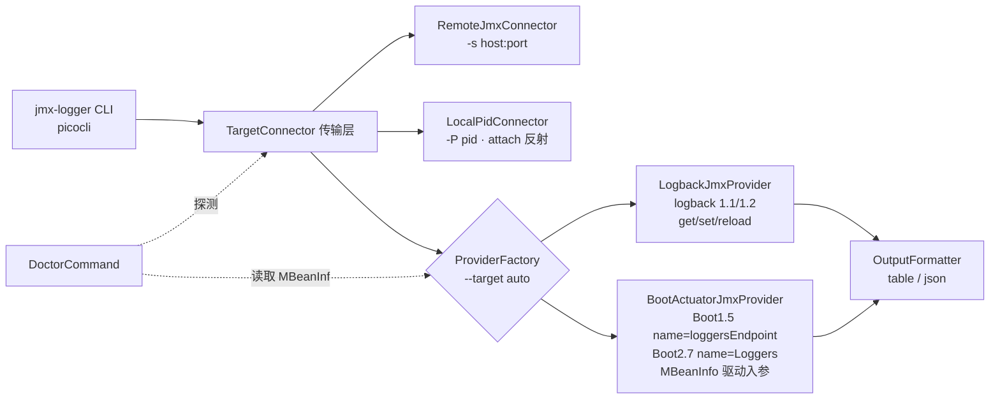

## 产品概述

`jmx-logger` 是一个独立 CLI 工具，通过 JMX 远程查看/修改 Logback 的 Logger 级别并重载配置。用户实际运行栈为 **JDK 1.8 + Spring Boot 1.5.6**，计划升级到 **Spring Boot 2.7.18**。需要一份分阶段、每阶段可独立验收与回滚的改进计划，而不是一次性重写。

## 已核实的关键前提（决定方案走向）

- **升级到 Spring Boot 2.7.18 不会破坏现有工具**：Boot 2.7.18 受管 `logback-classic = 1.2.12`，而 logback `v_1.1.11` 与 `v_1.2.13` 的 `ch/qos/logback/classic/jmx/` 目录文件完全一致（`JMXConfigurator.java` 均为 9660 字节），即 1.1.x → 1.2.x 的 JMX 操作面不变。现有 `JmxClient` 调用的方法名/ObjectName 在两个版本上都有效。
- **Boot 2.7.18 要求 Java 8**（兼容至 Java 21），因此 `maven.compiler.source/target=8` 必须保持不动。
- **Boot 2.7 的 Actuator JMX 默认全暴露**：`management.endpoints.jmx.exposure.include` 默认为 `*`，`loggers` 端点 JMX 列默认为 Yes ⇒ 只要目标应用带 actuator，即可零配置作为兜底通道（与 Boot 3.x 默认仅 `health` 不同，不可混写）。
- **logback ≥ 1.3 才彻底移除 JMXConfigurator**（`v_1.4.14`/`v_1.5.13`/master 已无 jmx 目录）。这只影响未来 JDK 17 + Boot 3 的场景，本计划通过 Provider 抽象预留，不作为当前重点。

### 真实目标进程实测结论（2026-09-19，本机 `127.0.0.1:19000` 上的 Boot 1.5 应用）

以下结论来自对真实目标 JVM 的 MBeanInfo 抓取 + logback `JMXConfigurator.java`（v_1.1.11 / v_1.2.12）源码逐行核对，是本计划的硬事实，**P1 重构与 P3/P4 编码必须以此为准，不得再靠猜**：

- **Logback 配置器 MBean 实际形态**（与现有代码假设一致，可放心保留）：
  `ch.qos.logback.classic:Name=default,Type=ch.qos.logback.classic.jmx.JMXConfigurator`
  属性：`LoggerList`（`java.util.List`，只读，经 RMI 反序列化为 `ArrayList<String>`，实测 783 项）、`Statuses`（只读）；
  操作：`String getLoggerLevel(String)`、`String getLoggerEffectiveLevel(String)`、`void setLoggerLevel(String,String)`、`void reloadDefaultConfiguration()`、`void reloadByFileName(String)`、`void reloadByURL(java.net.URL)`。
- **级别读取返回空串而非 `null`**：`getLoggerLevel` / `getLoggerEffectiveLevel` 在「logger 不存在」和「logger 未单独配置级别」两种情况下都返回 `""`（源码常量 `JMXConfigurator.EMPTY`）。因此判定"继承"必须判空串，**不能判 `null`**（现有 `GetCommand` 只判 `null`，导致真实输出是空白而非文档所写的 `(inherited)`，已在 P0 修掉）。
- **`setLoggerLevel` 的 null 语义与直觉相反**：源码开头即 `if (levelStr == null) return;`，传 **Java `null` 被静默忽略**；恢复"继承父 logger"必须传**字符串 `"null"`**（`"null".equalsIgnoreCase(levelStr)` → `logger.setLevel(null)`）；传入无法识别的级别字符串同样静默忽略（`Level.toLevel(x, null) == null`）。⇒ P4 的 `set inherit` 必须下发字符串 `"null"`，且本地要先做级别白名单校验，否则用户会看到"命令成功但级别没变"。
- **目标进程带 Spring Boot 1.5 actuator，且 JMX 暴露的是 Boot 1.5 命名模型**（不是 Boot 2 的 `name=Loggers`），实测签名：
  ```
  org.springframework.boot:type=Endpoint,name=loggersEndpoint
    ATTR Loggers : java.lang.Object
    OP   java.lang.Object getLoggers()
         → LinkedHashMap{ "levels"  → ArrayList<String> [OFF,ERROR,WARN,INFO,DEBUG,TRACE]
                          "loggers" → LinkedHashMap{ 名称 → {configuredLevel, effectiveLevel} } }
    OP   java.lang.Object getLogger(String loggerName)
         → LinkedHashMap{ "configuredLevel" → String|null, "effectiveLevel" → String|null }
    OP   void setLogLevel(String loggerName, String logLevel)
  ```
  返回值是**普通 LinkedHashMap（非 CompositeData/TabularData）**，未配置的 `configuredLevel` 是 Java `null`（与 logback 侧的空串不同）。⇒ Boot 1.5 兜底通道**现在就可用**，且 `getLoggers()` 一次拿全量（1 次 RMI vs logback 侧 2N 次），性能收益显著。**原计划"Boot 1.5 actuator 不在支持范围"的判断据此作废。**

## 核心功能增量（按用户收益排序）

1. **连不上也能用**：新增 `-P/--pid` 本地 attach（目标 JVM 未开 JMX 端口时，通过 attach API 动态启动本地管理代理）。
2. **知道为什么连不上**：新增 `doctor` 子命令，区分"没配 `<jmxConfigurator/>` / 没开 JMX 端口 / logback 版本过高 / 可走 Actuator 兜底"，并输出目标侧该加的配置。
3. **可插拔 Provider**：`logback-jmx`（现逻辑，支持 reload）与 `boot-actuator-jmx`（兜底，不支持 reload，**覆盖 Boot 1.5 与 2.7 两种命名模型**），`auto` 自动探测。
4. **健壮性与打磨**：统一错误退出码与 `--verbose`、支持重置为继承级别、`--object-name` 多 LoggerContext 选择、`--json` 输出、**logger 不存在时明确报错并返回非 0 退出码**、单元测试与目标侧配置文档。

## 技术栈

- 语言/构建：Java 8（`maven.compiler.source/target=8`，**不升级**），Maven + `maven-shade-plugin:3.5.1` 打 fat jar。
- 唯一运行时依赖保持 `info.picocli:picocli:4.7.6`；**不引入任何新的运行时第三方依赖**（JSON 走 JDK 自带 `HttpURLConnection` + 自写轻量解析，测试依赖仅 `junit:junit:4.13.2` test scope）。
- 目标侧：Spring Boot 1.5.6 / 2.7.18，logback 1.1.x / 1.2.x，JMX RMI。

## 实施策略

关键点是：**先把"传输层"与"日志操作 Provider"解耦**，后续能力逐层叠加，每一步都可回滚、每一步都有明确验收方式。



架构要点：

1. **Provider 优先顺序**：`auto` 下先探测 `ch.qos.logback.classic:Type=...JMXConfigurator,*`（能力最全，含 reload），找不到再探测 Boot 的 logger 端点。
2. **Actuator 端点必须双命名探测 + MBeanInfo 驱动，禁止写死签名**：
   - Boot **1.5**：`org.springframework.boot:type=Endpoint,name=loggersEndpoint`，操作 `getLoggers()` / `getLogger(String)` / `setLogLevel(String,String)`（已实测，见上文）。
   - Boot **2.7**：`org.springframework.boot:type=Endpoint,name=Loggers`，操作 `loggers()` / `loggerLevels(String)` / `configureLogLevel(String, ?)`。
   - 实现上不按版本号分支，而是**先查 ObjectName、再读 `mbsc.getMBeanInfo(name)` 的 `MBeanOperationInfo` 动态构造 `params/signature`**：入参 `String` 直接传；遇到自定义类型（如 `org.springframework.boot.logging.LogLevel`）走 `Class.forName + Enum.valueOf` 构造，失败则明确报错。
   - 返回值可能是 `LinkedHashMap`（Boot 1.5 实测）、CompositeData/TabularData 或 JSON 字符串，Provider 要按实际类型分发解析，统一收敛到 `LoggerInfo{name, configuredLevel, effectiveLevel}`。
   - `doctor` 子命令负责把每个候选端点的真实 MBeanInfo 打印出来，让这层版本差异始终可观测。
3. **能力协商**：`LoggerProvider.capabilities()` 声明是否支持 `reload`；Actuator Provider 下 `reload` 给出可执行替代建议（logback.xml 开 `scan="true"`，或目标侧加自定义 endpoint），而不是含糊失败。
4. **向后兼容**：阶段一/二对外的 `get/set/reload` 参数与输出格式保持不变；`auto` 的默认选择等价于今天的行为。

## 目标应用侧最小配置清单

- 走 Logback JMXProvider：`logback.xml` 中 `<jmxConfigurator/>` + 启动参数
`-Dcom.sun.management.jmxremote -Dcom.sun.management.jmxremote.port=19000 -Dcom.sun.management.jmxremote.rmi.port=19001 -Dcom.sun.management.jmxremote.authenticate=true -Dcom.sun.management.jmxremote.ssl=false -Djava.rmi.server.hostname=<本机IP>`（`rmi.port` 必须与 `port` 一致，否则防火墙后握手失败）。
- 走本地 PID attach：**目标侧零配置**（前提是本机同用户、非 JRE 最小镜像）。
- 走 Actuator 兜底（**Boot 1.5**：已实测可用；**Boot 2.7**：同左）：仅需 classpath 有 `spring-boot-starter-actuator`，无需 `management.*` 配置（默认 JMX include=`*`、loggers 默认暴露）；若目标是 Boot 3.x 才需要显式 `management.endpoints.jmx.exposure.include=health,loggers`。
  - Boot 1.5 的 ObjectName 是 `org.springframework.boot:type=Endpoint,name=loggersEndpoint`（小写开头 + `Endpoint` 后缀），Boot 2.7 是 `type=Endpoint,name=Loggers`，**两者都要探测**。

## 目录结构

```
/bak/java/jmx-logger/
├── pom.xml                                          # [MODIFY] 仅新增 junit 4.13.2 test 依赖；compiler 8 保持不变
├── Justfile                                         # [MODIFY] 补 build / run / doctor / test 目标
├── README.md                                        # [NEW] 用法、目标侧配置矩阵、升级到 2.7.18 的兼容性说明
└── src/main/java/com/jmxlogger/
    ├── JmxLoggerCli.java                            # [MODIFY] 注册 doctor；新增 --verbose/--timeout/--target/--json 全局选项；
    │                                                #          用 IExecutionExceptionHandler + ExitCode 统一收口（不再在子命令里 System.exit）
    ├── JmxClient.java                               # [MODIFY] 拆分为「连接层」+「Logback 调用」；保留方法名便于逐步迁移，
    │                                                #          内部委派给 transport/RemoteJmxConnector 与 provider/LogbackJmxProvider
    ├── GetCommand.java                              # [MODIFY] 改用 LoggerProvider；支持 --json；新增 --no-effective 减少 RMI 往返
    ├── SetCommand.java                              # [MODIFY] 白名单之外支持 inherit/null/clear 重置为继承级别
    ├── ReloadCommand.java                           # [MODIFY] 依据 capabilities 判定，Actuator provider 下输出替代方案
    ├── DoctorCommand.java                           # [NEW] 连接 → 列出候选 MBean → 打印 MBeanInfo 操作签名 → 给出目标侧应加的配置
    ├── ExitCodes.java / CommandSupport.java         # [NEW] 退出码常量与异常到退出码的映射
    ├── transport/
    │   ├── TargetConnector.java                     # [NEW] AutoCloseable，暴露 getMBeanServerConnection()
    │   ├── RemoteJmxConnector.java                  # [NEW] 现有 host:port RMI 逻辑迁移（service:jmx:rmi:///jndi/rmi://...）
    │   └── LocalPidConnector.java                   # [NEW] 反射调用 com.sun.tools.attach.VirtualMachine#startLocalManagementAgent，
    │                                                #          取 com.sun.management.jmxremote.localConnectorAddress 后连 JMX
    ├── provider/
    │   ├── LoggerProvider.java                      # [NEW] 接口：id()/list()/get()/setLevel(name, levelOrNull)/reload(file)/capabilities()
    │   ├── LoggerInfo.java                          # [NEW] name / configuredLevel / effectiveLevel
    │   ├── LogbackJmxProvider.java                  # [NEW] 迁移现有 getLoggerLevel/setLoggerLevel/reloadByFileName 等调用
    │   ├── BootActuatorJmxProvider.java             # [NEW] 双命名探测（Boot1.5 loggersEndpoint / Boot2.7 Loggers），
    │   │                                            #      按 MBeanInfo 决定入参与返回值解析（Map / CompositeData / JSON 串）
    │   └── ProviderFactory.java                     # [NEW] auto/logback-jmx/boot-jmx 选择与探测顺序
    ├── support/
    │   ├── JmxInvocation.java                       # [NEW] 按 MBeanOperationInfo 构造 signature/params（解决 LogLevel 枚举不确定性）
    │   └── OutputFormatter.java                     # [NEW] 表格与 JSON 两种输出
    └── src/test/java/com/jmxlogger/
        ├── ProviderSelectionTest.java               # [NEW] 用平台 MBeanServer 注册桩 MBean 验证 auto 探测顺序
        └── LogbackJmxProviderTest.java              # [NEW] 验证 list/get/set/重置行为
```

## 关键执行要点（防回归）

- **Java 8 语法红线**：不用 `var`、`List.of`、`` ` ``、Stream API 新特性之外的 JDK9+ API。
- **attach 在 JDK 8 的可行性**：`com.sun.tools.attach.VirtualMachine#startLocalManagementAgent()` 在 JDK 8 中存在，但类在 `tools.jar` 里，不在默认 classpath。实现要用反射 + `URLClassLoader.addURL` 动态把 `${java.home}/../lib/tools.jar` 挂进来；捕获 `ClassNotFound`/`AttachNotSupported` 并给出可操作提示（换 JDK 而非 JRE；同一 OS 用户；`/tmp` 可写；容器需共享 PID namespace）。JDK 9+ 无 `tools.jar`，同一份反射代码天然兼容。
- **性能（2026-09-19 实测后定论，不要再回到"并发化"方案）**：常用路径是**单 logger 的 `set`/`get`**，其耗时构成是 `java -jar --help` ≈ 287 ms（JVM 启动 + picocli）vs `get ROOT` ≈ 340 ms —— **JMX 只占约 50 ms**（单次 invoke 是 1 ms 级、连接握手约 143 ms 冷启动）。⇒ **并发化 2N 次调用的方案已否决**：对主路径零收益，只会增加复杂度。全量列出（783 个 logger ⇒ 1566 次往返 ≈ 361 ms，端到端 793 ms）是唯一慢路径但属低频，优化留给 P3 的 Actuator 批量读（Boot 1.5 `getLoggers()` 实测 1 次调用 50 ms 拿全量）；Logback Provider 侧无法批量，`--no-effective` 保留为逃生口（默认行为不变）。另外「level 非空就跳过 effective 调用」的设想已实测否决：783 个 logger 里 769 个 level 为空，只能省 14 次调用。
- **级别语义红线（已实测，写死在代码注释与测试里）**：读取侧"未配置/不存在"是**空串**不是 `null`；写入侧重置继承要传**字符串 `"null"`**，传 Java `null` 或非法级别会被目标静默忽略。任何一层再引入 `null` 语义都要先回来核对本节。
- **安全**：`-p` 明文密码建议改为环境变量/交互式读取，避免在 ps 输出中泄漏；凭证不进日志。
- **错误输出**：禁止打印完整堆栈到标准输出；`--verbose` 才打印堆栈，且过滤掉认证信息。
- **变更半径**：阶段一只做重构与新增，不改既有行为；`auto` 默认路径必须等价于改造前的 JmxClient 行为，确保 Back Boot 1.5.6 环境零影响。

## 实施阶段与验收

| 阶段 | 目标 | 主要改动 | 验收方式 |
| --- | --- | --- | --- |
| P1 | 抽象与诊断 | transport/ + provider/ 骨架、`LogbackJmxProvider` 迁移、`DoctorCommand`、统一退出码 | 对现有 Boot 1.5.6 目标 `get/set/reload` 行为与改造前完全一致；`doctor -s host:port` 能列出候选 MBean 与操作签名 |
| P2 | 本地 attach | `LocalPidConnector`、`-P/--pid` | 对未开 JMX 端口的本机进程：`get -P <pid>` 成功；容器内/JRE 缺失时给出明确报错而非堆栈 |
| P3 | Actuator 兜底（**Boot 1.5 + 2.7 双命名**） | `BootActuatorJmxProvider`（先查 `name=loggersEndpoint`，再查 `name=Loggers`，签名与返回值由 MBeanInfo 决定）+ `ProviderFactory` auto | ① 现网 Boot 1.5 目标上 `--target boot-jmx get` 用 1 次 RMI 列出全部 logger，且结果与 `--target logback-jmx` 一致；② 目标未配 `<jmxConfigurator/>` 但带 actuator 时 `--target auto` 自动切换；③ `reload` 给出替代方案而非崩溃 |
| P4 | 打磨 | `--json`、`set inherit`（下发字符串 `"null"`）、`--object-name`、**logger 不存在报错 + 非 0 退出码**、单测、Justfile、README | 单元测通过；`get --json` 可被脚本消费；`get 不存在的名字` 打印"未找到 logger X"且退出码为 3 |
| P5 | 未来 Boot 3 预留 | 基于已有 Provider 接口扩展 HTTP Provider / 自定义 endpoint 指引 | 文档化差异（JMX 默认仅 `health`、logback ≥1.3 无 JMXConfigurator、`configureLogLevel` 入参类型），不写代码实现 |

### P4 新增：logger 不存在的处理契约

当前 `get <name>` / `get <name> -r` 在目标上查不到时，会打印一行空白数据（或"未找到以 X 开头的 logger"）并**以 0 退出**，脚本无法判断是否真的查到了。P4 统一改为：

| 场景 | 输出（stderr） | 退出码 |
| --- | --- | --- |
| `get <name>`：目标上不存在该 logger | `未找到 logger <name>` | `3` |
| `get <name> -r`：无任何匹配 | `未找到以 "<name>" 开头的 logger` | `3` |
| `--json` 模式 | 除 stderr 提示外，stdout 输出空结果 `{"loggers":[]}`，保证仍可被脚本解析 | `3` |

退出码约定（在 `ExitCodes` 与 README 中同步定稿）：`0` 成功、`1` 运行时错误（连不上、MBean 不存在、JMX 调用失败）、`2` 用法错误（非法级别、参数缺失）、**`3` 未找到（logger 不存在 / 过滤无匹配）**。选独立码而非复用 `1`，是为了让脚本能区分"目标上没这个 logger"与"根本没连上"。


### 已完成（P0，先于 P1 落地）：连接超时

原属 P4 的"超时控制"提前到 P1 之前做——它是体感最差的一项：RMI 握手没有超时参数，
网络不通时命令会一直挂到 TCP 默认超时（可达数分钟），比缺功能更难受。

- 新增全局选项 `--timeout <秒>`，默认 **10 秒**，`0` 表示不限制（等同改造前行为）。
- 实现：`JmxClient` 把 `JMXConnectorFactory.connect` 放到**守护线程**里跑，由 `Future#get(timeout)` 限时，
  超时即放弃并抛出带排查清单的 `IOException`（退出码 `1`）。没走 `sun.rmi.*` 系统属性或自定义
  `RMIClientSocketFactory`——前者覆盖面不确定，后者只能覆盖部分握手阶段；守护线程方案对
  "JNDI 查注册表"与"连 RMI 数据端口"两个阶段都成立。
- 实测：黑洞地址 `192.0.2.1:19000 --timeout 3` ⇒ 3.58 s 报错退出（含 JVM 启动约 0.35 s），退出码 1；
  真实目标（本机 19000）行为不变。
- 测试：`TestJmxServer.BlackholeServer`（只 accept、不回应）覆盖超时分支；`<= 0` 分支沿用原有报错文案。

## 各阶段主要风险

- P1：重构期间最容易回归的是 `ObjectName` 拼接与 `invoke` 签名，必须保留现有常量与原样调用路径。
- P2：attach 受限于 OS 权限、JRE（无 tools.jar）、容器 PID namespace；失败分支必须先于功能分支实现。
- P3：Actuator 操作签名与返回值形态存在版本差异（Boot 1.5 的 `setLogLevel(String,String)` 与 `LinkedHashMap` 返回值已实测；Boot 2.7 的 `configureLogLevel` 第二参可能是 `String` 也可能是 `LogLevel` 枚举、返回值可能是 OpenData 复合结构），因此本阶段以 `doctor` 实测签名驱动，先探测后编码，禁止猜测。**Boot 2.7 的签名尚未实测**，需要在升级后的真实进程（或临时起的 2.7 demo）上抓一次 MBeanInfo 再落地。
- P4：`--json` 输出与退出码一旦发布即成为契约，字段名与码值需一次定稿；新增的退出码 `3` 要同时同步到 `ExitCodes`、`README` 与本文档。
- P5：Boot 3.x 的 JMX 默认只暴露 `health`、logback ≥1.3 已无 `JMXConfigurator`，届时只剩 HTTP/自定义 endpoint 一条路；本阶段只出文档，不写代码。
  （**注**：原计划"Boot 1.5 actuator 属旧命名模型、不在支持范围"一条已作废——Boot 1.5 端点已在真实进程上实测可用，且是现网唯一可行的兜底通道，已并入 P3。）